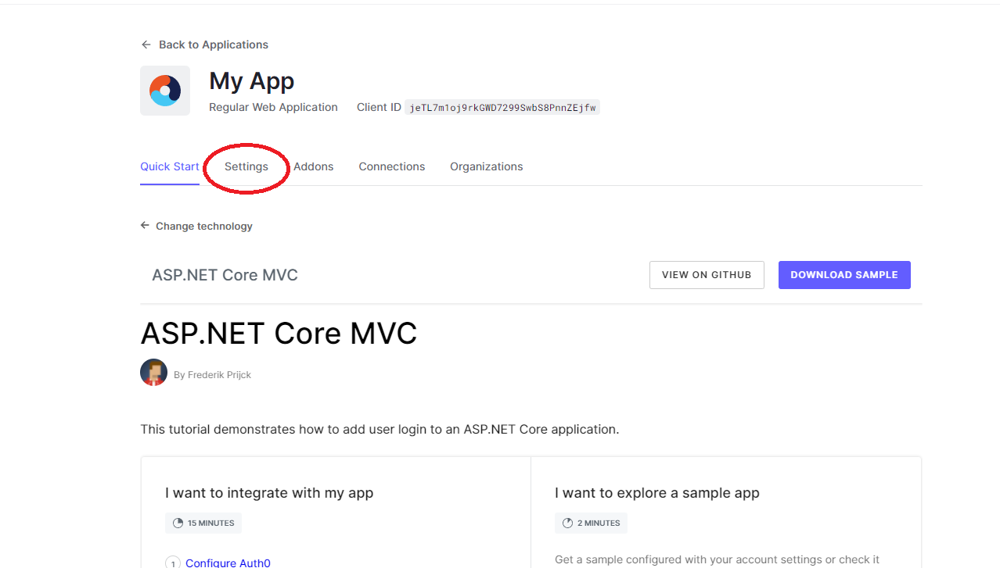
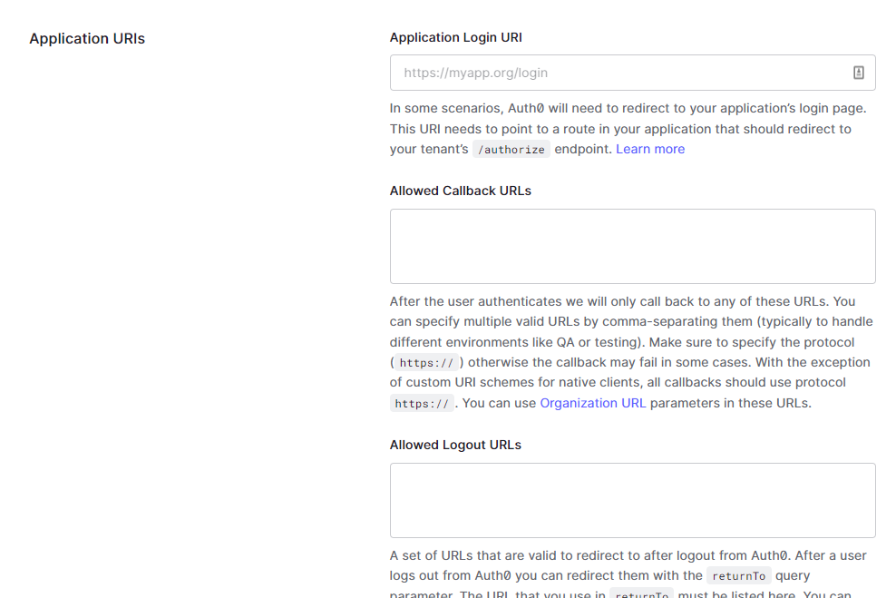
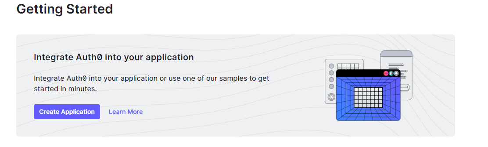
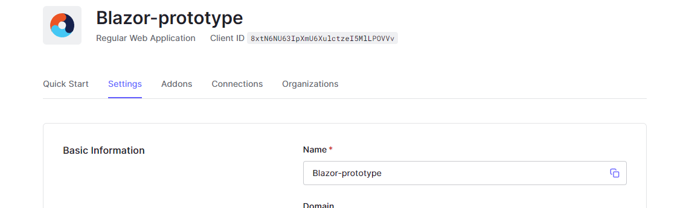

# Workshop Auth0
Voor deze workshop over Auth0 kan je het project in de main branch gebruiken van deze repository. Maar deze workshop is natuurlijk ook te gebruiken voor de Inside Airbnb casus.

Deze workshop is geschreven voor het volgende type project:
* ASP.NET Core 3.0
* Blazor

Maar wanneer je iets anders gebruikt dan blazor (bijv. Voor inside airbnb) is de workshop ook prima te volgen en zullen de verschillen minimaal zijn.

Branches:  
[Main] Project zonder auth0 implementatie  
[Post-Auth0] Volledige uitwerking van workshop.

## Aanmaken Auth0 account

1. Ga naar [https://auth0.com/](https://auth0.com/) en maak een account aan
2. Na het inloggen zou je de ‘Getting Started’ pagina moeten zien. Klik daar op create application (ziet er soms ander
   uit).



3. Doorloop het proces. Kies een naam voor je applicatie, type applicatie en een technologie.
    1. De opties die ik heb gekozen zijn:
        1. Regular Web Applications
        2. ASP.NET Core 3.0
4. Als het goed is heb je nu een applicatie aangemaakt in het management portaal van Auth0 en zit je op de ‘Application
   Details’ pagina en is het tabblad ‘Quick Start’ van de gemaakte applicatie.



5. Ga naar het ‘Settings’ tabblad (Rechts van ‘Quick Start’ knop | zie afbeelding) en scroll naar de sectie ‘Application
   URIs’.



6. Vul een allowed callback URL in. In verband met het gebruikte nuget package eindigd de URL in ons geval altijd op
   /callback.
    2. Bijvoorbeeld: [http://localhost:7011/callback](http://localhost:7011/callback)
7. Vul een allowed Logout URL in.
    3. Bijvoorbeeld: [http://localhost:7011/](http://localhost:7011/)

## Configuratie App

1. Als je de vorige sectie hebt gevolgd zou je nu nog op de ‘Application Details’ pagina op het tabblad ‘Settings’
   moeten zitten. Scroll terug omhoog naar ‘Basic Information’



2. Vanuit de Basic Information sectie kopieer het domein en clientID naar de `appsettings.json`

```json
// appsettings.json

{
  "Logging": {
    "LogLevel": {
      "Default": "Information",
      "Microsoft.AspNetCore": "Warning"
    }
  },
  "AllowedHosts": "*",
  "Auth0": {
    "Domain": "YOUR_AUTH0_DOMAIN",
    "ClientId": "YOUR_CLIENT_ID"
  }
}
```

3. Installeer de volgende nuget package. (Al geinstalleerd in prototype.)

```

dotnet add package Auth0.AspNetCore.Authentication

```

4. Zorg dat `Program.cs` er als volgd uitziet:

```c#
// Program.cs

using QuizManager.Data;
using Auth0.AspNetCore.Authentication; // 👈 new code

var builder = WebApplication.CreateBuilder(args);

// 👇 new code
builder.Services
    .AddAuth0WebAppAuthentication(options => {
      options.Domain = builder.Configuration["Auth0:Domain"];
      options.ClientId = builder.Configuration["Auth0:ClientId"];
    });
// 👆 new code

// Add services to the container.
builder.Services.AddRazorPages();

// ...existing code...
app.UseRouting();
app.UseAuthentication(); // 👈 new code
app.UseAuthorization();  // 👈 new code
app.MapBlazorHub();
app.MapFallbackToPage("/_Host");
app.Run();
```

## Inloggen, Uitloggen en Registreren

Nu gaan we de knoppen en pagina’s maken die nodig zijn voor het inloggen en uitloggen.

### Inloggen

1. Maak een nieuwe pagina aan in de `Pages` map. Noem deze pagina Login. Er zouden twee bestanden aangemaakt moeten
   zijn, namelijk `Login.cshtml` en `Login.cshtml.cs`.
2. Plaats het volgende in het `Login.cshtml.cs` bestand.

```c#
using Auth0.AspNetCore.Authentication;

using Microsoft.AspNetCore.Authentication;

using Microsoft.AspNetCore.Mvc.RazorPages;

namespace Auth0_Blazor_Prototype.Pages;

public class Login : PageModel
{
    public async Task OnGet(string redirectUri)
    {
        var authenticationProperties = new LoginAuthenticationPropertiesBuilder()
            .WithRedirectUri(redirectUri)
            .Build();
        await HttpContext.ChallengeAsync(Auth0Constants.AuthenticationScheme, authenticationProperties);
    }
}
```

3. Voor het maken van een inlog knop kan je de volgende code gebruiken.

```html
<a href="/login?redirectUri=/">
    Login
</a>
```

De redirectUri parameter wordt doorgegeven als argument van de onGet functie aangemaakt in `Login.cshtml.cs`. De
redirect URI is de pagina waar de gebruiker op terug komt na het inloggen of registreren.

### Registreren

1. Maak wederop een pagina aan in de `Pages` map en noem deze ‘Signup’.
2. Plaats het volgende in `Signup.cshtml.cs`

```c#
using Auth0.AspNetCore.Authentication;
using Microsoft.AspNetCore.Authentication;
using Microsoft.AspNetCore.Mvc.RazorPages;
namespace Auth0_Blazor_Prototype.Pages;

public class Signup : PageModel
{
    public async Task OnGet(string redirectUri)
    {
        var authenticationProperties = new LoginAuthenticationPropertiesBuilder()
            .WithRedirectUri(redirectUri)
            .WithParameter("screen_hint", "signup")
            .Build();
        await HttpContext.ChallengeAsync(Auth0Constants.AuthenticationScheme, authenticationProperties);
    }
}
```

Het verschil hier is dat er een `.WithParameter()` functie wordt meegegeven waarin wordt aangegeven dat wanneer we naar
het login scherm gaan de registratie pagina geopend willen hebben.

3. Voor de registratie knop kan de volgende code gebruikt worden:

```html
<a href="/signup?redirectUri=/">
    Sign up
</a>
```

### Uitloggen

1. Maak wederop een pagina aan en noem deze `Logout`
2. Plaats het volgende in `Logout.cshtml.cs`

```c#
using Auth0.AspNetCore.Authentication;
using Microsoft.AspNetCore.Authentication;
using Microsoft.AspNetCore.Authentication.Cookies;
using Microsoft.AspNetCore.Authorization;
using Microsoft.AspNetCore.Mvc.RazorPages;
namespace Auth0_Blazor_Prototype.Pages;

public class Logout : PageModel
{
    [Authorize]
    public async Task OnGet()
    {
        var authenticationProperties = new LogoutAuthenticationPropertiesBuilder()
            .WithRedirectUri("/")
            .Build();

        await HttpContext.SignOutAsync(Auth0Constants.AuthenticationScheme, authenticationProperties);
        await HttpContext.SignOutAsync(CookieAuthenticationDefaults.AuthenticationScheme);
    }
}
```

`[Authorize]` voor een functie of klasse zorgt ervoor dat de functie of klasse alleen kan worden gebruikt wanneer de
gebruiker is ingelogd.

3. Voor de logout knop kan je de volgende code gebruiken:

```html
<a href="/logout">
    Logout
</a>
```

### Authorisatie

De navigatieknoppen voor het inloggen, registreren en uitloggen zijn zonder autorisatie altijd zichtbaar voor de
gebruiker. Zowel een login knop en een uitlog knop op je scherm hebben is raar.

Html objecten kunnen vertoont of verborgen worden aan de hand van autorisatie state. Bekijk de volgende code:

```html
<CascadingAuthenticationState>
    <AuthorizeView>
        <Authorized>
            <a href="/logout" class="inline-block bg-gray-700 text-white px-4 py-2 rounded-md shadow-sm">
                Logout
            </a>
        </Authorized>
        <NotAuthorized>
            <a href="/login?redirectUri=/" class="inline-block bg-gray-700 text-white px-4 py-2 rounded-md shadow-sm">
                Login
            </a>
            <a href="/signup?redirectUri=/" class="inline-block bg-gray-700 text-white px-4 py-2 rounded-md shadow-sm">
                Sign up
            </a>
        </NotAuthorized>
    </AuthorizeView>
</CascadingAuthenticationState>
```

Door `</Authorized>` en `</NotAuthorized>` in een `<CascadingAuthenticationState>` en `<AuthorizeView>` te plaatsen kan
afhankelijk van of de gebruiker is ingelogd of niet, bepaald worden welke dingen zichtbaar zijn.

## Gebruikersprofiel

Wanneer een gebruiker is ingelogd wordt er gebruikersinformatie met het token meegegeven. Zoals de gebruikersnaam en
profielfoto url.

In het codeblok van een razor page kan met de volgende code die informatie opgehaald worden.

```c#
@code {
    private string Username = "Anonymous User";
    private string Picture = "";
    private string Role = "";

    protected override async Task OnInitializedAsync()
    {
        var state = await AuthState.GetAuthenticationStateAsync();   

        Username = state.User.Identity.Name ?? string.Empty;   

        Picture = state.User.Claims
            .Where(c => c.Type.Equals("picture"))
            .Select(c => c.Value)
            .FirstOrDefault() ?? string.Empty;

   
        Role = state.User.Claims
            .Where(c => c.Type.Contains("role"))
            .Select(c => c.Value)
            .FirstOrDefault() ?? string.Empty;

       await base.OnInitializedAsync();

    }
}
```

Deze informatie kan in het gebruikersinterface gebruikt worden zoals zo:

```html
<CascadingAuthenticationState>
    <div class="rounded-lg bg-gray-200 col-span-8 p-4">
        <AuthorizeView>
            <Authorized>
                <h1 class="text-2xl font-bold text-gray-700">Welcome, @Username!</h1>
            </Authorized>
            <NotAuthorized>
                <h1 class="text-2xl font-bold text-gray-700">Hi, Signup or login to continue.</h1>
            </NotAuthorized>
        </AuthorizeView>
        ...
```

## Ophalen van user role

Zoals je kan zien onder het vorige kopje, wordt er ook een query gedaan naar de role van de gebruiker. Een rol van een
gebruiker wordt niet standaard met het token meegegeven. Om dat te regelen moet je een rule toevoegen in het auth0
management portaal. Er zijn twee methodes om role management te regelen. Auth0 heeft een rollen systeem alleen moet je
daar de betaalde versie voor hebben (of tijdelijk in de trial periode). Ik zelf geef rollen aan via app_metadata in
gebruikersprofielen. App_metadata is in de gratis versie van auth0 te gebruiken.

Hieronder leg ik kort uit hoe je een regel aanmaakt waardoor rollen worden meegegeven met het token en gebruikt kunnen
worden in de front-end.

1. Open het auth0 management portaal.
2. Ga naar Auth pipeline > Rules
3. Maak een lege regel aan.
4. Gebruik de volgende code als regel

**Role management van auth0:**

```c#
function setRoles(user, context, callback) {
    const assignedRoles = (context.authorization || {}).roles;
    let idTokenClaims = context.idToken || {};
    idTokenClaims['http://schemas.microsoft.com/ws/2008/06/identity/claims/role'] = assignedRoles;
    context.idToken = idTokenClaims;
    callback(null, user, context);
}
```

**Role management via app_metadata**

```c#
function setRoles(user, context, callback) {
    const assignedRoles = (user.app_metadata || {}).roles;
    let idTokenClaims = context.idToken || {};
    idTokenClaims['http://schemas.microsoft.com/ws/2008/06/identity/claims/role'] = assignedRoles;
    context.idToken = idTokenClaims;
    callback(null, user, context);
}

```

Zoals je ziet zijn er minimale verschillen tussen de twee regels.

## App_metadata

Voor het toevoegen van app_metadata doe je het volgende.

1. Ga naar de User management in auth0 management portaal
2. Ga naar User details van een gebruiker
3. Scroll naar app metadata
4. Voeg het volgende toe om een rol aan te geven.

```json
{
  "roles": "admin"
}
```

5. Vergeet niet op te slaan.

## Role Management

Role management kan je vinden in het auth0 management portaal onder: ‘User Management’ > ‘Roles’.

## Andere resources:

* Blazor Auth0 tutorial
    * [How to Build and Secure Web Applications with Blazor](https://auth0.com/blog/what-is-blazor-tutorial-on-building-webapp-with-authentication/)
* Documentatie van gebruikte Nuget package met alle mogelijkheden
    * [Auth0 SDK for ASP.NET Core Authentication](https://github.com/auth0/auth0-aspnetcore-authentication)
* Metadata gebruiken
    * [Understand How Metadata Works in User Profiles](https://auth0.com/docs/manage-users/user-accounts/metadata)